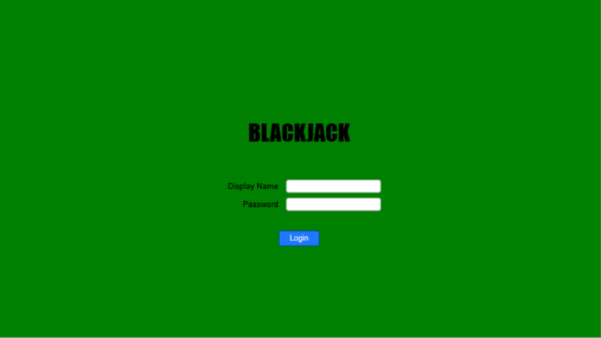
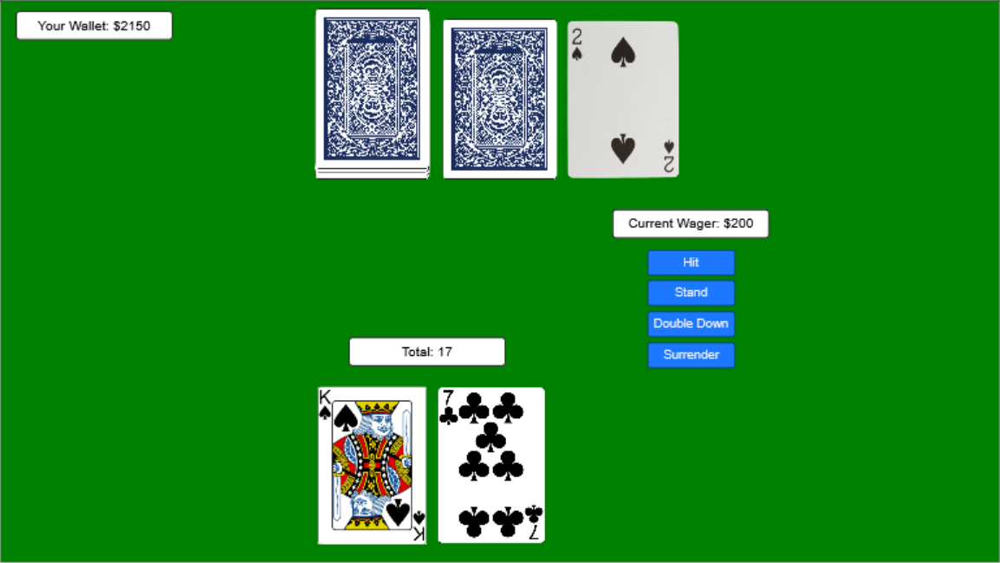
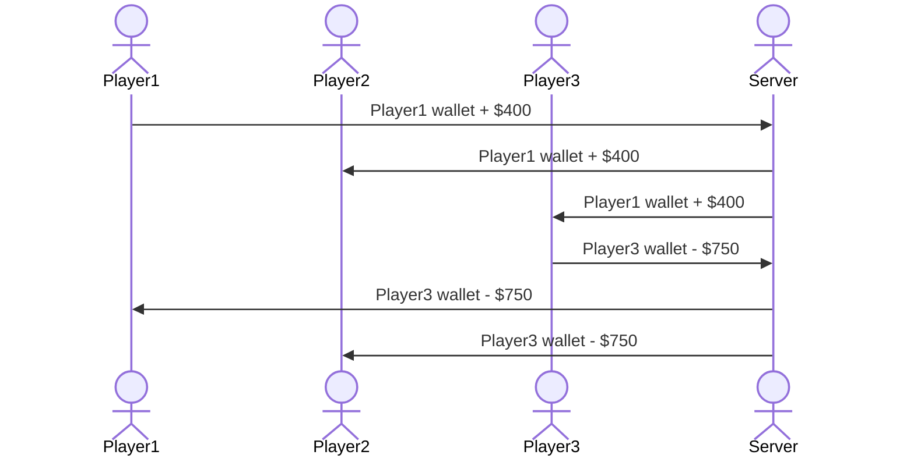

# Blackjack

[My Notes](notes.md)

## 🚀 Specification Deliverable

For this deliverable I did the following. I checked the box `[x]` and added a description for things I completed.

- [x] Proper use of Markdown - done
- [x] A concise and compelling elevator pitch - inshallah it is compelling
- [x] Description of key features - listed the main points of the application's functionality
- [x] Description of how you will use each technology - done
- [x] One or more rough sketches of your application. Images must be embedded in this file using Markdown image references. - Included mock images of the login page and the game itself, plus an example of users' interactions with the server.

### Elevator pitch

Before the invention of the internet, before both world wars, before the Gilded Age, the Louisiana Purchase, the French Revolution, and the birth of America, the card game Vingt-et-un was created in France. The game has persisted over the last three centuries, coming to be known as Twenty-one to English-speaking audiences, and later as Blackjack. This application simulates the high-stakes casino classic with fake cash, and allows players to compete for the highest total winnings.

### Design

Login page:

In-game view:

### Key features

- Secure login
- Starting wallet of 1000 (fake) dollars
- Ability to play blackjack against an automated dealer
- Official game rules and options
- Leaderboard to compare your total earnings to those of other players

### Technologies

I am going to use the required technologies in the following ways.

- **HTML** - Basic structure of app. This includes the login page, the game, and the leaderboard.
- **CSS** - Styling to match the rough draft displayed in the mock design above.
- **React** - Login and gameplay functionality; which action the user takes.
- **Service** - Deck of cards API (https://deckofcardsapi.com/) that tracks cards used and displays cards in play.
- **DB/Login** - Receives player's earnings/losses after each game and updates their wallet.
- **WebSocket** - Display of other players' earnings in the leaderboard.

## 🚀 AWS deliverable

For this deliverable I did the following. I checked the box `[x]` and added a description for things I completed.

- [x] **Server deployed and accessible with custom domain name** - [My server link](https://blackjackonline.click).

## 🚀 HTML deliverable

For this deliverable I did the following. I checked the box `[x]` and added a description for things I completed.

- [x] **HTML pages** - Added HTML pages for Home, Play, Leaderboard, and Rules.
- [x] **Proper HTML element usage** - I completed this part of the deliverable.
- [x] **Links** - I completed this part of the deliverable.
- [x] **Text** - I completed this part of the deliverable.
- [x] **3rd party API placeholder** - Added images to represent cards on Play page.
- [x] **Images** - Added site icon.
- [x] **Login placeholder** - I completed this part of the deliverable.
- [x] **DB data placeholder** - Included Leaderboard page.
- [x] **WebSocket placeholder** - Included notifications on Play page.

## 🚀 CSS deliverable

For this deliverable I did the following. I checked the box `[x]` and added a description for things I completed.

- [x] **Header, footer, and main content body** - The header and footer are hidden on the login page but are visible throughout the rest of the site.
- [x] **Navigation elements** - From the home page, the login buttons will bring the user to the play page. From there, they can navigate freely using the menu in the header.
- [x] **Responsive to window resizing** - I completed this part of the deliverable.
- [x] **Application elements** - I completed this part of the deliverable.
- [x] **Application text content** - I completed this part of the deliverable.
- [x] **Application images** - I completed this part of the deliverable.

## 🚀 React part 1: Routing deliverable

For this deliverable I did the following. I checked the box `[x]` and added a description for things I completed.

- [x] **Bundled using Vite** - I installed and configured Vite using NPM and tested throughout construction using the "npm run dev" command to bundle code to a temporary directory. After construction, I used Vite to fully build and deploy the code.
- [x] **Components** - Replaced all component .html files with .jsx files that use React. Updated certain visuals and layouts to better fit the design.
- [x] **Router** - All pages on the site can be reached using the nav bar. The user can also navigate from the Login page to the Play page using the "Login" and "Create" buttons.

## 🚀 React part 2: Reactivity

For this deliverable I did the following. I checked the box `[x]` and added a description for things I completed.

- [x] **All functionality implemented or mocked out** - Blackjack is now fully playable, although card probabilities do not necessarily reflect those of an actual deck (to be implemented using the Deck of Cards API). Usernames and wallet values are saved to local storage and will be visible on the Leaderboard page. Mocked notifications are sent periodically, along with real-time notifications based on the user's actions.
- [x] **Hooks** - Included many const variables in game.jsx that utilize useState and setState. Also implemented several instances of useEffect to control function calls based on state changes.

## 🚀 Service deliverable

For this deliverable I did the following. I checked the box `[x]` and added a description for things I completed.

- [x] **Node.js/Express HTTP service** - I set up the required services using Node.js and Express.
- [x] **Static middleware for frontend** - I completed this part of the deliverable.
- [x] **Calls to third party endpoints** - I implemented the Deck of Cards API to track cards that have been used and to add images for cards in use. (https://www.deckofcardsapi.com/?ref=freepublicapis.com)
- [x] **Backend service endpoints** - I implemented backend endpoints for registration, login, logout, and wallet tracking.
- [x] **Frontend calls service endpoints** - I called the registration, login, and logout endpoints in various files within login/, and used wallet calls in play/game.jsx and leaderboard/leaderboard.jsx.

## 🚀 DB/Login deliverable

For this deliverable I did the following. I checked the box `[x]` and added a description for things I completed.

- [x] **User registration** - Unauthorized users are registered in the database.
- [x] **User login and logout** - Authorized credentials are retrieved from the database.
- [x] **Stores data in MongoDB** - Users' wallet contents and date last played are stored in the database.
- [x] **Stores credentials in MongoDB** - Users' emails and (hashed) passwords are stored in the database.
- [x] **Restricts functionality based on authentication** - Unauthorized users must create an account before they can login. Users who are not logged in can not access the majority of the site.

## 🚀 WebSocket deliverable

For this deliverable I did the following. I checked the box `[x]` and added a description for things I completed.

- [x] **Backend listens for WebSocket connection** - The index.js file implements peerProxy.js to listen for a WebSocket connection.
- [x] **Frontend makes WebSocket connection** - The gameNotifier.js file connects to the frontend to the socket.
- [x] **Data sent over WebSocket connection** - Messages are sent over the connection whenever a user places a wager or finishes a game.
- [x] **WebSocket data displayed** - The players.jsx file receives information from gameNotifier.js to display all received notifications.
- [x] **Application is fully functional** - I completed this part of the deliverable.
